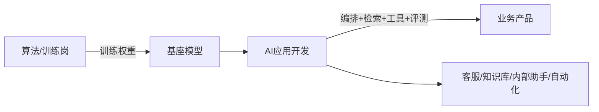
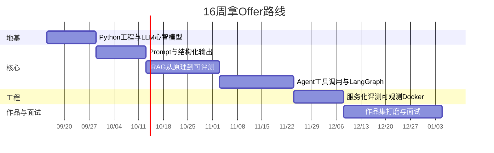
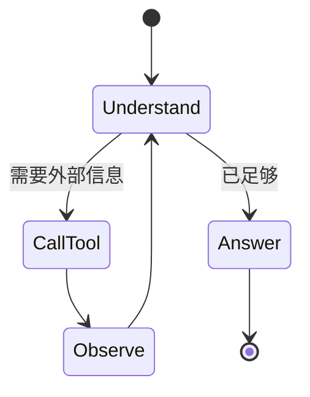

# AI 应用开发：从概念到拿 Offer

> 对齐 2026 年 Boss / 猎聘 / 智联 50+ 真实 JD。岗位本质是**工程落地**，不是训练大模型。
> 目标：独立做出 2 个非玩具级项目，能讲清 RAG / Agent / 评测，拿到不错的 AI 应用开发 offer。

---

## 0. 市场在招什么

### 0.1 岗位叫什么（投递关键词）

| 优先级 | 搜索词 | 说明 |
|---|---|---|
| P0 | AI应用开发工程师 | 数量最多 |
| P0 | AI Agent开发工程师 | 增长最快 |
| P0 | RAG开发工程师 / LLM应用开发 | 最对口 |
| P1 | Python大模型开发（LangChain） | 中小公司常用 |
| P1 | AI开发工程师（Dify） | 低代码落地岗 |
| P2 | Python后端开发 | 保底，带 AI 项目投 |

Boss / 猎聘可直接搜以上词。直链会被风控拦截，请你本机打开：

- Boss：`AI应用开发` `Agent` `RAG` `LangChain`
- 猎聘：同上，再加 `大模型应用`

### 0.2 真实 JD 技能频率（2026-05）

| 技能 | 出现率 | 层级 |
|---|---|---|
| Python | 100% | 门槛 |
| LangChain | ~80% | P0 |
| LLM 应用经验 | ~70% | P0 |
| RAG | ~60% | P0 |
| Prompt Engineering | ~45% | P0 |
| 向量库（Milvus / Qdrant / Chroma） | ~40% | P0 |
| Dify / Coze | ~35% | P1 |
| 微调（LoRA 等） | ~35% | P2，高级岗 |
| LangGraph | ~25% | P1 |
| FastAPI | ~20% | P1 |
| MCP | ~10% | P2，新兴加分 |

### 0.3 薪资锚点（一线）

- 应届 / 转行起步：8k–15k
- 1–2 年或作品扎实：12k–25k（RAG/Agent 岗常见 18k 起）
- 3–5 年：20k–40k
- 目标：「不错 offer」= 一线 18k+ 或新一线 15k+，带完整 RAG + Agent 作品集

### 0.4 面试官真正在验什么

不是「会不会调 API」，而是：

1. 能不能把文档变成可检索知识库（分块 / embedding / 召回 / 重排）
2. 能不能让模型**可靠地用工具**（Function Calling / Agent）
3. 能不能把链路做成服务（FastAPI + 鉴权 + 日志 + 评测）
4. 出了幻觉、召回差、超时，你怎么定位和改

---

## 1. 先建立岗位地图（10 分钟搞懂分工）

| 角色 | 干什么 | 你要不要学 |
|---|---|---|
| 算法工程师 | 训练/微调模型、刷指标、发论文 | 了解即可，不是主线 |
| **AI 应用开发（你）** | RAG、Agent、API、评测、接入业务 | **主线** |
| 后端 | 服务、数据库、权限、稳定性 | 必须会一部分 |
| 产品 | 场景、流程、验收 | 要能沟通 |

一句话：**别人造发动机，你造能上路的车。**

---

## 2. 16 周总路线

按每周 15–20 小时设计。已有 Python 后端基础可压缩到 10–12 周。

| 阶段 | 周次 | 你必须能独立做到 |
|---|---|---|
| 0 心智模型 | W1 | 讲清 token / context / 幻觉 / temperature |
| 1 Python 工程 | W1–W2 | 异步、类型、测试、包管理、读 JSON/日志 |
| 2 LLM API | W3–W4 | 流式输出、tool schema、结构化 JSON |
| 3 RAG | W5–W7 | 自建知识库问答，有召回指标 |
| 4 Agent | W8–W10 | 多工具 Agent + 状态机（LangGraph） |
| 5 生产化 | W11–W12 | FastAPI 服务、评测集、Docker、简单观测 |
| 6 Offer | W13–W16 | 2 个作品上线/可演示 + 面试题库过一遍 |

---

## 3. 分阶段：概念 → 动手 → 验收

每阶段都按同一节奏：**先懂原理 → 手写最小实现 → 用框架重写 → 加评测 → 能讲给面试官。**

### 阶段 0｜W1 前 3 天：LLM 心智模型

**必须搞懂的概念**

- Token：模型不读「字」，读切出来的片段。中文大约 1 字 ≈ 1–2 token。
- Context window：一次能塞进去的上限。超了会截断或报错。
- 补全 vs 对话：chat 只是把 system/user/assistant 拼成一段补全。
- Temperature / top_p：随机性。做工具调用、抽 JSON 时要低。
- 幻觉：模型会编。工程上用检索、约束输出、引用、评测来压，而不是「提示它别编」。
- 系统提示 vs 用户提示：规则放 system，任务放 user。

**最小实验（今天就做）**

1. 同一问题，temperature=0 和 0.8 各跑 5 次，对比稳定性。
2. 把一篇长文塞进 prompt，逐步加长直到报错，体会 context 上限。
3. 让模型「引用原文回答」，故意给它没有的资料，看它会不会编。

**过关标准**：能用自己的话讲清「为什么 RAG 能减幻觉，但不能消灭幻觉」。

---

### 阶段 1｜W1–W2：Python 工程能力（岗位 100% 要求）

不是学语法，是学**能上生产线的写法**。

**必会**

- 虚拟环境：`uv` 或 `conda`（推荐 uv）
- 类型标注 + Pydantic 校验 LLM 输出
- `httpx` / `openai` SDK 流式调用
- `asyncio`（并发打 embedding、并发调工具）
- `pytest` 最小测试
- 日志：请求 id、耗时、token 用量
- Git + 清晰 README

**练习**

写一个 `llm_client.py`：

- 统一封装 OpenAI 兼容接口（通义 / DeepSeek / 本地 vLLM 都能换 base_url）
- 支持 stream / 非 stream
- 失败重试、超时、记录 token

**过关标准**：换一个模型，只改配置，业务代码不动。

---

### 阶段 2｜W3–W4：Prompt 与结构化输出

JD 里 45% 写 Prompt Engineering，面试必问。

**概念**

- 指令、约束、示例（few-shot）、输出格式，四段式。
- Chain-of-Thought：让模型先想再答；生产上常用「先检索再答」，少用裸 CoT。
- 结构化输出：JSON Schema / tool calling，比「请输出 JSON」可靠得多。
- 护栏：敏感词、越权、提示注入（用户文档里藏「忽略以上指令」）。

**练习**

1. 简历解析器：非结构化文本 → 严格 JSON（姓名/技能/年限）。
2. 提示注入对抗：把恶意文档丢进知识库，系统仍只回答业务问题。

**过关标准**：用 Pydantic 校验，格式错误自动重试，成功率 > 95%（20 条样例）。

---

### 阶段 3｜W5–W7：RAG（出现率 ~60%，核心护城河）

这是拿 offer 的分水岭。很多人会调 `VectorStore.from_documents`，但讲不清为什么差。

```mermaid
flowchart TD
  D[原始文档] --> C[清洗/解析 PDF HTML]
  C --> S[分块 chunk]
  S --> E[Embedding]
  E --> V[(向量库)]
  Q[用户问题] --> QE[问题向量]
  QE --> R[召回 TopK]
  R --> RR[重排序 rerank]
  RR --> CTX[拼上下文]
  CTX --> LLM[带引用生成]
  LLM --> ANS[答案 + 来源]
```

**必须手写一遍（不要一上来就 LangChain）**

1. 自己切块：按标题 / 按 token 数 / 有重叠。
2. 调 embedding API，算余弦相似度，自己写 top-k。
3. 把检索到的片段塞进 prompt，要求「没有依据就说不知道」。
4. 再换成 Chroma / Qdrant。
5. 再加 BGE-reranker 或 API rerank。
6. 最后才用 LangChain / LlamaIndex 重写，对比差异。

**坑（面试高频）**

| 症状 | 常见原因 | 你该怎么说 |
|---|---|---|
| 答非所问 | 分块太大/太碎、没重叠 | 讲 chunk size 与 overlap 的权衡 |
| 找不到答案 | 问题与文档用词不一致 | query 改写、HyDE、多路召回 |
| 答案拼凑错误 | 只靠向量、没有 rerank | 向量召回 + 精排 |
| 幻觉仍多 | 没强制引用、上下文太脏 | 引用编号、低 temperature、拒答 |
| 很慢 | 每次全量 embed、同步调用 | 缓存、批量、异步 |

**本阶段作品雏形：个人知识库助手**

- 本地文档（PDF/Markdown/网页）
- 引用原文段落
- 简单 UI（Streamlit 即可）
- 20 条问答评测集：命中率 / 拒答率

**过关标准**：能画上面那张图，并指出你项目里每一层的实现和失败案例。

---

### 阶段 4｜W8–W10：Agent + Tool Calling + LangGraph

JD 增长最快的方向。LangChain 80%，LangGraph 25% 且在涨。

**概念分层（别混）**

| 名词 | 是什么 |
|---|---|
| Function / Tool Calling | 模型输出「要调哪个函数 + 参数」，你的代码去执行 |
| ReAct | 想→行动→观察→再想，循环直到结束 |
| Agent | 带工具、记忆、循环的决策器 |
| LangGraph | 用状态图管循环、分支、人机确认，比裸 while 可控 |
| Multi-agent | 多个角色分工，先别碰，单 Agent 扎实再学 |

**必须手写**

1. 不用框架：while 循环 + tool schema + 最多 N 步 + 超时。
2. 工具：`search_docs`、`calculator`、`http_get`（模拟查天气/查订单）。
3. 加上：最大步数、工具白名单、参数校验、把观察结果截断。
4. 再用 LangGraph 重写成 StateGraph（节点：retrieve / reason / act / end）。

**本阶段作品：业务助手（二选一做深）**

- A. 内部 IT/HR 助手：查制度 + 提工单（工具模拟即可）
- B. 数据分析助手：上传 CSV，自然语言出统计和结论

**过关标准**：能讲「Agent 翻车的 5 种方式」：死循环、工具选错、参数幻觉、权限泄露、费用爆炸——以及你怎么防。

---

### 阶段 5｜W11–W12：生产工程（拉开候选人差距）

很多人停留在 notebook。Offer 给能上线的人。

**必做清单**

- FastAPI：`/chat` 流式 SSE、API Key、请求限流
- 配置与密钥：`.env`，绝不进 Git
- 会话记忆：按 `session_id` 存 Redis 或 SQLite
- 评测：Golden set 50 条，离线跑 faithfulness / 引用命中
- 观测：每次请求记录检索片段、工具轨迹、耗时、token
- Docker 一键启动
- 可选：Dify 搭一个对照原型（JD 里 35% 要）

**加分（P2，有时间再做）**

- MCP 接一个本地工具
- 用 Docker 起 Qdrant
- 了解 vLLM / Ollama 本地模型
- LoRA 微调「知道即可」，除非 JD 点名

---

### 阶段 6｜W13–W16：作品集 + 面试 + 投递

**作品集最低配置（2 个，不要 10 个半成品）**

1. **RAG 知识库**：解析 → 分块 → 召回 → 重排 → 带引用回答 → 评测报告
2. **Agent 业务助手**：LangGraph + 3 个以上工具 + 轨迹可视化 + 护栏

每个仓库必须有：

- 1 分钟架构图（README 里 mermaid）
- 5 分钟演示脚本（录屏更好）
- 「我踩过的坑」一节
- 评测数字（即使很小）

**面试题按层背（先理解再背）**

1. embedding 是什么，余弦相似度为什么能用
2. chunk 怎么选，overlap 干什么
3. 稀疏检索（BM25）和稠密检索区别，为什么要混合
4. rerank 放在哪一层
5. function calling 和普通 prompt 的差别
6. LangGraph 比 LangChain Chain 解决了什么
7. 如何评测 RAG（不能只说「感觉还行」）
8. 提示注入怎么防
9. 流式输出 SSE 怎么做
10. 成本：token、缓存、降级模型路由

**投递策略**

- 先投：AI 创业公司、传统企业 AI 部门、外包里明确写 LangChain/RAG 的组
- 大厂当练习投，不作为唯一目标
- 简历关键词原词出现：Python、LangChain、LangGraph、RAG、向量库、FastAPI、评测
- 项目写法：场景 + 你做的决策 + 指标，不写「负责参与」

---

## 4. 技术栈最终清单（对照 JD）

**P0 不会就很难过筛**

- Python、Git、Linux 基础
- OpenAI 兼容 API、Prompt、结构化输出
- RAG 全流程 + 一个向量库（建议 Qdrant 或 Chroma）
- LangChain 核心概念（会用，且知道底层在干什么）
- 至少一种 Agent（手写 + LangGraph）

**P1 拉开差距**

- FastAPI 流式、Docker、简单评测
- Rerank、混合检索、query 改写
- Dify 能演示
- 日志与 token 成本意识

**P2 锦上添花**

- MCP、多 Agent、微调 LoRA、K8s、Go/Java

---

## 5. 推荐资源（少而精）

只跟这些，避免课程收藏家：

1. 官方：OpenAI / DeepSeek 文档里的 Chat Completions + Tool Calling
2. LangChain 文档：python.langchain.com（先 LCEL，再 LangGraph）
3. LangGraph 官方教程：有状态图、checkpoint、human-in-the-loop
4. 向量库：Qdrant 或 Chroma 官方「从零 RAG」
5. 评测：RAGAS 文档看概念即可，自己先做规则评测
6. 模型：DeepSeek API 或通义，本地用 Ollama + Qwen

不建议一上来看 Transformer 论文推导。应用岗面试几乎不问公式展开。

---

## 6. 本周任务（从今天开始）

**Day 1–2**

- [ ] 读完本文第 0–1 节，能向别人讲清「应用岗 vs 算法岗」
- [ ] 注册 DeepSeek 或通义 API（或装 Ollama）
- [ ] 完成阶段 0 三个实验，把现象记下来

**Day 3–7**

- [ ] 搭好 `uv` 项目骨架：`llm_client` + `.env` + pytest
- [ ] 实现非流式 / 流式 / 失败重试
- [ ] 用自己的话写一页笔记：token、context、幻觉、temperature

做完这些，回复「阶段 0 做完了」，我会带你进入 Prompt / 结构化输出，并当场改你的代码。

---

## 7. 你需要告诉我的背景（方便校准进度）

下一条消息尽量带上：

1. 现在身份：在校 / 应届 / 转行（原岗位）
2. Python 水平：会不会写类、异步、FastAPI
3. 有没有调过 GPT/通义 API
4. 每周能投入多少小时
5. 目标城市和薪资心理价位

---

## 8. 市场校验（2026-10-05 第 1 轮情报回写）

> 来源：[../job-market/](../job-market/README.md) —— 每 3 天轮巡一次江浙沪岗位。
> **本节只写"本计划需要因为市场而修改的部分"**，其余不动。

### 8.1 本计划哪些地方已被市场验证（不需要改）

| 计划里的判断 | 市场证据 | 结论 |
| --- | --- | --- |
| "RAG / Agent / 评测是核心" | 60.97% 的 AI 岗位是应用开发（Agent/Workflow/RAG/工具调用） | ✅ 方向对 |
| "LangChain / Dify 要会" | 7/11 家 JD 明确要求，复旦 JD 点名 Dify/LangChain | ✅ 保持 |
| "FastAPI + Docker 是 P1 拉开差距" | 实际是 9/11 家要 FastAPI、8/11 家要 Docker | ⚠️ **应升为 P0** |
| "评测：Golden set 50 条" | 7/11 家 JD 要求"效果评估 / 评测体系" | ✅ 保持，但**应加重量级** |
| "向量库建议 Qdrant 或 Chroma" | 5/11 家提到 Milvus / Chroma | ✅ 保持 |

### 8.2 必须改的三条

| # | 原文 | 改成 | 为什么 |
| --- | --- | --- | --- |
| 1 | FastAPI / Docker 列在 **P1 拉开差距** | **升到 P0** | 9/11 家要 FastAPI、8/11 家要 Docker。这不是"拉开差距"，是**入场券**。苏州工业园区、南京江宁的岗位几乎全都写这两条 |
| 2 | 本计划末尾"你需要告诉我的背景"第 5 问"目标城市" | 已明确：**苏州（工业园区/高新区）+ 南京（江宁/雨花台），备选上海** | 本轮已采集到具体样本：同程旅行 15-30K·15薪、思迹信息 15-30k·13薪（均要求服务化能力） |
| 3 | 阶段 6「作品集最低配置」2 个作品 | **保持 2 个，但第 1 个要加两样：人工审核节点 + 权限角色** | 思迹信息（苏州园区）JD 原话要求"设计人机协同、人工审核、权限控制机制"；德赛西威（南京）要求"权限管控" |

### 8.3 新增的两条要求（原计划没有）

| 新增项 | 证据 | 挂在哪 |
| --- | --- | --- |
| **多智能体协同 / 工作流编排** | 4/11 家（含德赛西威明确要求"多智能体协同、工作流编排"），且在涨 | 阶段 3–4 之间加一次 LangGraph 双 Agent 练习 |
| **原生 Function Calling** | 6/11 家；本计划阶段 4 用的是手写 JSON 解析 | 阶段 4 内改写：把工具定义换成模型的 `tools` 参数 |

### 8.4 明确不用管的（市场已确认低优先）

| 项 | 原计划位置 | 市场证据 |
| --- | --- | --- |
| K8s | P2 锦上添花 | 6/11 家只要 Docker；K8s 是"或有" → 维持 P2 |
| Go / Java | P2 | 各 2–3 家，且是另一条技术栈 → 维持 P2，甚至可删 |
| Transformer 论文推导 | 已注明"不建议" | ✅ 市场确认：应用岗不问公式 |

### 8.5 针对苏州/南京的一条地域性调整

> 苏州市场特征（第三方汇总原话）：**"2026 年苏州本地企业更倾向招有落地经验的人，
> 纯研究背景的硕士如果没做过完整项目，面试通过率会打折扣。"**

**对你的含义**：这一条**对你有利**——你有 stage0–5 六个阶段的完整项目。
但要让它生效，**必须有"能演示"的形态**（公网 URL / 录屏 / 清晰 README），
否则在 HR 眼里你和"没做过项目"没区别。

→ 所以阶段 6 的「作品集」不是收尾工作，**是这一轮投递能否成立的前提**。

---

